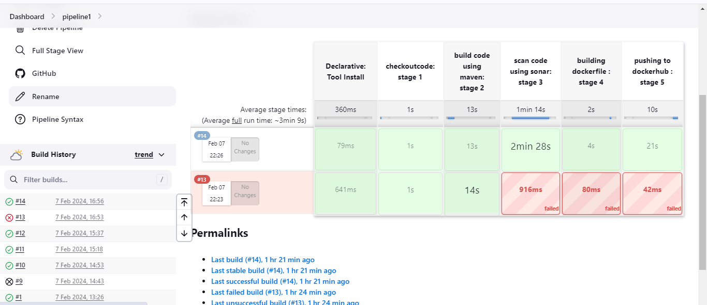
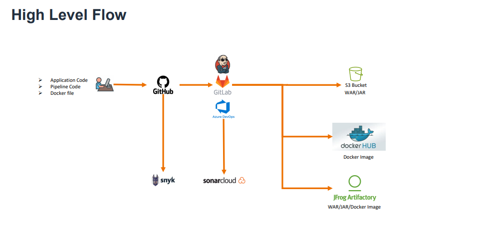
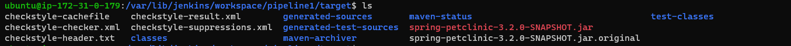
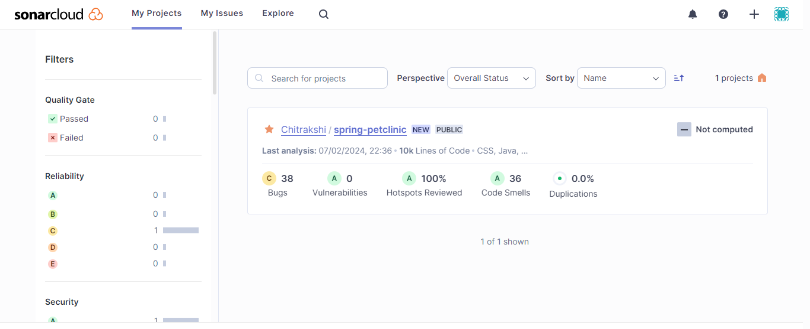
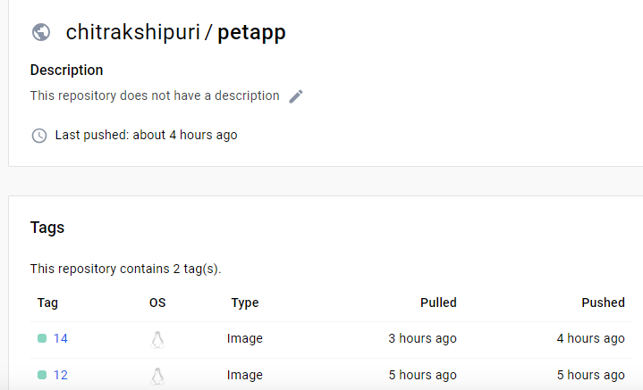
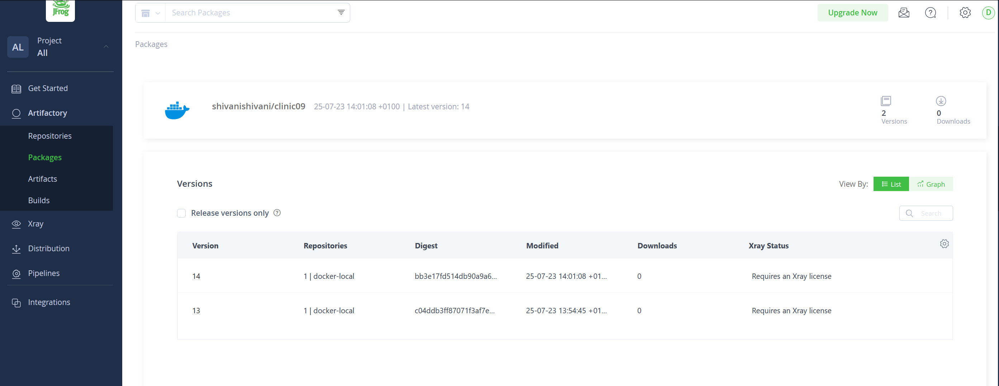

# Spring PetClinic Sample Application [](https://github.com/spring-projects/spring-petclinic/actions/workflows/maven-build.yml)

[](https://gitpod.io/#https://github.com/spring-projects/spring-petclinic) [](https://github.com/codespaces/new?hide_repo_select=true&ref=main&repo=7517918)

## Understanding the Spring Petclinic application with a few diagrams

[See the presentation here](https://speakerdeck.com/michaelisvy/spring-petclinic-sample-application)

## Run Petclinic locally

Spring Petclinic is a [Spring Boot](https://spring.io/guides/gs/spring-boot) application built using [Maven](https://spring.io/guides/gs/maven/) or [Gradle](https://spring.io/guides/gs/gradle/). You can build a jar file and run it from the command line (it should work just as well with Java 17 or newer):

```bash
git clone https://github.com/spring-projects/spring-petclinic.git
cd spring-petclinic
./mvnw package
java -jar target/*.jar
```

You can then access the Petclinic at <http://localhost:8080/>.


## Building a Container

There is no `Dockerfile` in this project. You can build a container image (if you have a docker daemon) using the Spring Boot build plugin:

```bash
./mvnw spring-boot:build-image
```


## Continuos Integration for application (Part2 of Project)






## STEPS:

1. Performed static code analysis using Sonarcloud 
2. Build application using maven 
3. Performed security vulnerability test using SonarQube
4. Build a Dockerfile(This project doesnt contain Dockerfile, have to create it after building application)
5. Produce the containerize docker image as final output
6. Used JFrog Artficatory and DockerHub to store Jar/Docker Images














## Database configuration

In its default configuration, Petclinic uses an in-memory database (H2) which
gets populated at startup with data. The h2 console is exposed at `http://localhost:8080/h2-console`,
and it is possible to inspect the content of the database using the `jdbc:h2:mem:<uuid>` URL. The UUID is printed at startup to the console.

A similar setup is provided for MySQL and PostgreSQL if a persistent database configuration is needed. Note that whenever the database type changes,  the app needs to run with a different profile: spring.profiles.active=mysql for MySQL or spring.profiles.active=postgres for PostgreSQL.

You can start MySQL or PostgreSQL locally with whatever installer works for your OS or use docker:

```bash
docker run -e MYSQL_USER=petclinic -e MYSQL_PASSWORD=petclinic -e MYSQL_ROOT_PASSWORD=root -e MYSQL_DATABASE=petclinic -p 3306:3306 mysql:8.2
```

or

```bash
docker run -e POSTGRES_USER=petclinic -e POSTGRES_PASSWORD=petclinic -e POSTGRES_DB=petclinic -p 5432:5432 postgres:16.1
```

can also use the provided `docker-compose.yml` file to start the database containers. Each one has a profile just like the Spring profile:

```bash
docker-compose --profile mysql up
```

or

```bash
docker-compose --profile postgres up
```


